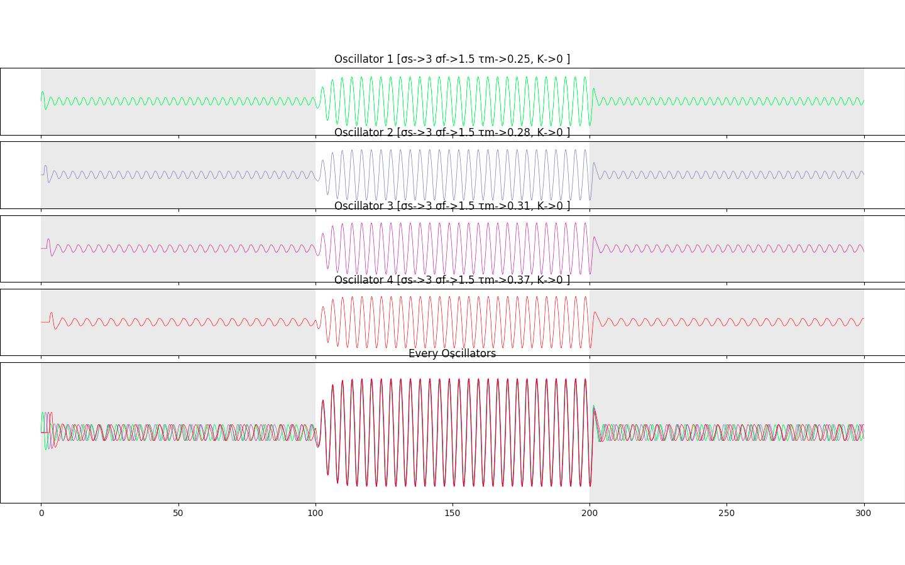
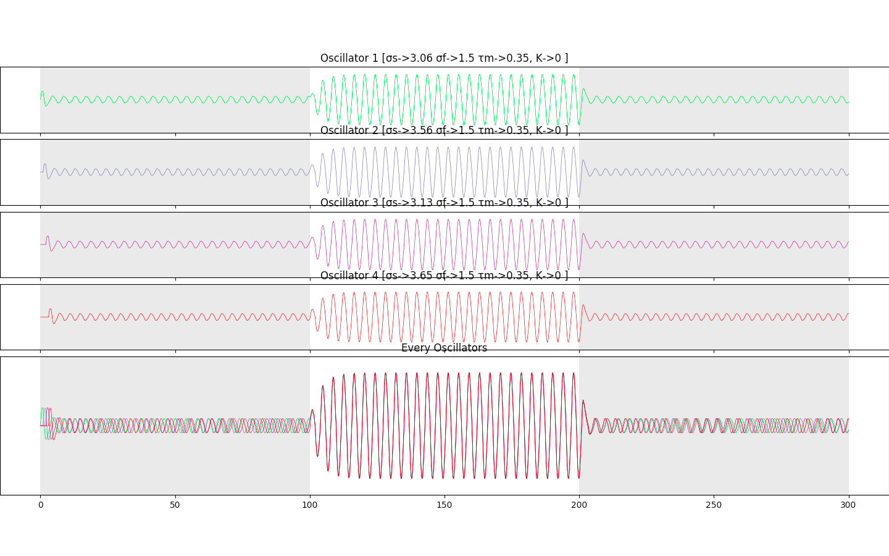
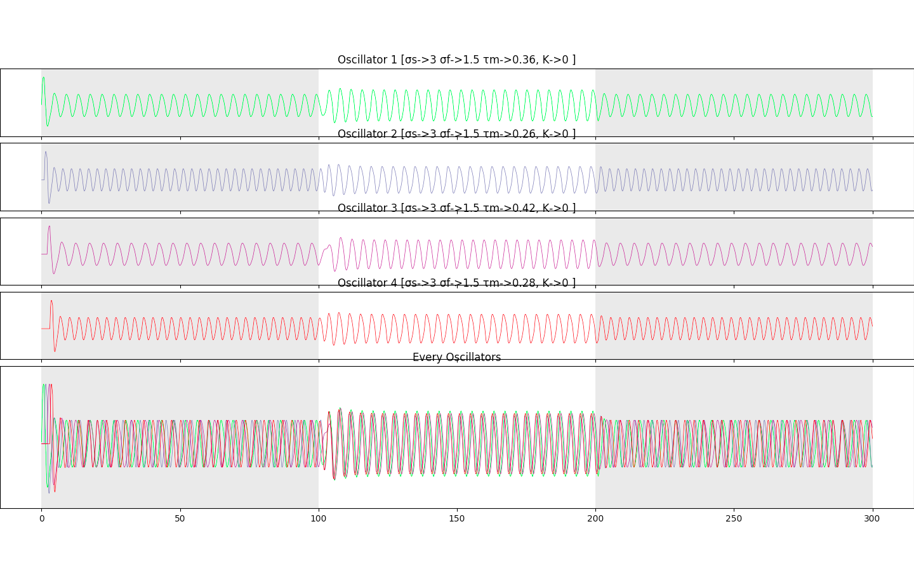
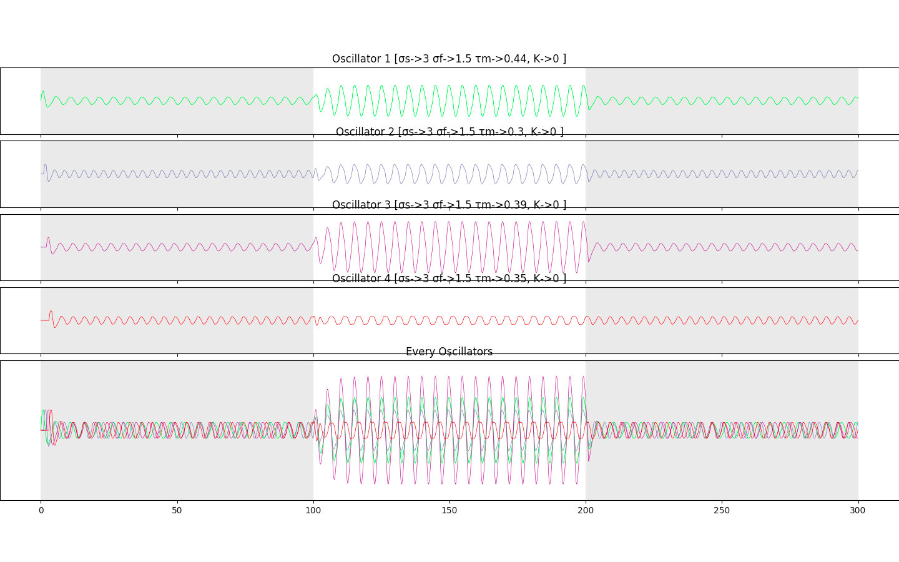

# Oscillators - Computational Neurosciences  

Rendu du projet Oscillators. Modéliser des oscillateurs de Rowat-Selverston, qui s'influencent à l'aide d'un réseau de synapse.

L'objectif et de montrer la convergence des oscillateurs de fréquence proche une fois connectés par un réseau de synapses.

Ce programme permet de simuler une période d'existence des oscillateurs, avec un maximum de paramétrage possible.

Les couples de valeurs sigma S et sigma F  de chacuns des oscillateurs sont paramétrés pour représenter un état oscillant, mais il est possible de les modifier manuellement.  

## Résultats du code  

### Variation des paramètres intrinsèques des oscillateurs
Nous remarquons qu'avec les paramètres laissés dans l'exemple run.py , les oscillateurs ayant des fréquences très proches arrive à se syncrhoniser comme le montre l'image suivante **_(mode="tau" dans le generateur d'oscillateurs fourni)_** : 

En générant des oscillateurs à sigmaS **_(mode="sigmaS" dans le generateur d'oscillateurs fourni)_** variable mais similaire, nous constatons également se phénomène d'oscillateurs à fréquence proche qui se synchronisent.  
  

**PS:** En fonction de l'initialisation des paramètres (ici, aléatoire dans un certain range), nous voyons des phases de transition plus ou moins chaotique. Les exemples fournis ici utilisent des poids synaptiques relativement forts (i.e, 0.3), la phase de transition est donc moins chaotique car la convergence se fait plus rapidement.  

### Variation des poids synaptiques  

La variation des poids synaptiques provoque aussi des phénomènes intéressants. Les précédents exemples utilisaient des poids à 0.3. En utilisant des poids faibles **_(mode="low-neutral" dans le generateur de synapses fourni)_** Nous remarquons d'autres phénomènes, cachés par les précédents. Ainsi, la phase peut des fois s'avérer plus chaotique, comme pour l'oscillateur 3 de l'exemple ci dessous. Également, les oscillateurs se synchronisent mais garde un déclage constant.  

    

Enfin, en initialisant les poids de manière aléatoire entre -1 et 1, nous remarquons des comportements forcément plus chaotiques au début, mais une convergence nait tout de même **_(mode="random" dans le generateur de synapses fourni)_** . Il est intéressant de noter que malgré la synchronisation, les amplitudes ne varient pas de la même manière.   

Je ne saurais pas l'expliquer, je suppose que le jeu des poids synaptiques inhibiteurs/excitants somment leurs effets ce qui limite certains oscillateurs dans l'amplitude d'oscillation. Il m'est arrivé dans un cas de ne pas voir la convergence arriver dans la plage de connexion des synapses settled ici, mais on remarque que ce n'était qu'une question de temps ( _non reproduit pour screen malheureusement..._ ) :

  

  
 
## Explication des classes  

### Periods : La simulation à effectuer

**Un objet Period,** va posséder des oscillateurs, des synapses, et certains paramètres qui lui seront utile pour jouer la simulation et déclencher des évènements (ex: activer les synapses, donner une impulsion aux oscillateurs individuellement, etc...).
Les paramètres obligatoires sont : 

-  **oscillators** : Une liste d'objets oscillateurs, chacun définit à notre guiseindépendamment des autres.  

-  **synapses** : une liste de dictionnaires représentant nos synapses, décrivant toutes les connexions existantes entre les oscillateurs. Les poids de chaque synapses définissent en valeur absolue _l'impacte_ du pre-synapse sur le post-synapse, et le signe du poids définit si le pre-synapse est _inhibiteur/exciteur_ du post-synapse. 

-  **trigger_times** : une liste d'integer , de la taille du nombre d'oscillateurs. Chaque valeur au rang i , décrit le temps auquel l'oscillateur de rang i va être déclenché manuellement. Mettre une valeur négative pour ne jamais déclencher l'oscillateur en question.  

L'objet Period lance la simulation complète avec la commande launch. Cette commande est chainable, pour effectuer un plot (display graphs) dans la foulée. Initialement, l'objet effectue 300000 periodes de 0.1s, ce qui représente une simulation de 300 secondes (5 minutes).

Deux modes d'affichage sont fournis, un subplot (celui utilisé dans run.py) et un plot, où tous les oscillateurs sont sur la même figure.
  

### Oscillator : Les objets à simuler  

Oscillator est la classe d'objets oscillateurs, et va envelopper tous les paramètres inhérents à un oscillateur.

Ainsi, sa définition se fait en fournissant l'ensemble de ses paramètres, même si un oscillateur "d'origine" tout ce qu'il y a de plus classique est générable si on omet les paramètres à l'initialisation. 

**Chaque oscillateur sauvegarde ses etats en fonction des périodes d'occurence**, ainsi la mémoire des différents etats d'un oscillateur n'est pas gérée par la period mais par chaque oscillateur individuellement. Un nouvel etat est généré en éxécutant **next_state**, en fournissant les paramètres externes influençant la création de son nouvel état.  

Cette fonction est déclenchée par l'objet de simulation (Period) pour tous les oscillateurs à chaque moment (période) simulé pa l'objet.  
  
  
### Generators : Pour simuler rapidemment   

Ce fichier fourni des fonctions permettant de générer rapidement des listes d'oscillateurs, de synapses et de trigger_times, essentiels pour créer et lancer un objet Period. Ainsi, trois générateurs sont fournis:  

- **gen_oscillators**, il génère une liste de n oscillateurs. Plusieurs modes sont possibles.   

	- **mode="tau"** , va faire varier le tauM entre 0.25 et 0.45 pour chaque générateur créé, et initialiser les autres constantes de manière à toujours obtenir des oscillateurs acceptables.  

	
 	- **mode="tauK"** , va faire varier le tauM entre 0.25 et 0.45 pour chaque générateur créé, et également faire varier la constante K entre tauM et tauS entre 10 et 20. Il initialise les autres constantes de manière à obtenir des résultats respectables, mais le double aléatoire rend l'expérience moins contrôlable.  

 	
  	- **mode="K"** , va faire varier la constante K entre tauM et tauS entre 10 et 20. Il initialise les autres constantes de manière à toujours obtenir des oscillateurs acceptables.  

  	
  	- **mode="sigmaS"** , va faire varier la constante sigmaS entre 0.2 et 0.5 . Il initialise les autres constantes de manière à toujours obtenir des oscillateurs acceptables.  

  	
  	- **Pas de mode** , il initialise des oscillateurs très standards, tous identiques.    

- **gen_synapses**, il génère une liste de n oscillateurs. Plusieurs modes sont possibles.   

	- **mode="neutral"** , initialise une matrice de synapses pour n oscillateurs. Aucun synapse pour les oscillateurs sur eux même (poids=0). Les poids entre tous les oscillateurs est de 0.3. Ils sont tous exciteurs. Cela représente un poids moyen, ni trop petit ni trop élevé.    

	- **mode="low-neutral"** , initialise une matrice de synapses pour n oscillateurs. Aucun synapse pour les oscillateurs sur eux même (poids=0). Les poids entre tous les oscillateurs est de 0.1 . Ils sont tous exciteurs. Cela représente un poid assez faible, la synchronisation se fait lentement et certains phénomènes sont assez visibles  

	- **mode="random"** , initialise une matrice de synapses pour n oscillateurs. Aucun synapse pour les oscillateurs sur eux même (poids=0). Les poids entre tous les oscillateurs est définit aléatoirement entre -1 et 1. Ils sont ainsi soit excitateur, soit inhibiteurs. Les poids peuvent être élevés comme faibles, le hasard donne des résultats très variés.  

	- **Pas de mode** , initialise une matrice de synapses pour n oscillateurs. Aucun synapse pour les oscillateurs sur eux même (poids=0). Les poids entre tous les oscillateurs est de 1 . Ils sont tous exciteurs. Cela représente un poid très fort, mène souvent à une divergence.  

- **gen_trigger**, Pas de modes fourni. Il génère simplement une liste de taille n pour n oscillateurs, et décide de déclencher l'oscillateur i à i secondes de la simulation (Ainsi, il faut faire attention que la simulation paramétrée dans l'objet Period dure assez longtemps pour que le trigger i-ème soit déclenché). **Dans le code actuel, seul des integer peuvent être renseignés dans cette liste.**  

### Run : Le lieux de l'expérimentation  

Ce fichier sert simplement à éxécuter des simulations. L'exemple fourni est le schéma d'utilisation pensé en codant les différents objets de ce rendu. 

**Aucune exception n'est levée dans les codes fournis. Ainsi, faites bien attention à renseigner le même N aux différents générateurs, des synapses générés pour K oscillateurs alors qu'il n'y a que N (avec N<K) oscillateurs dans les faits, mènera forcément à une erreur python. Pareil pour le nombre de trigger_times, si il n' y en a pas assez, une erreur sera levée.

### Oscillator\_with\_sin : Un exemple standalone 

_Ici simplement pour répondre à la demande de l'exercice de fournir un exemple d'oscillateur influencé par une sinusoïde. Peu d'intérêts, ne possède aucune interraction avec le reste du code._